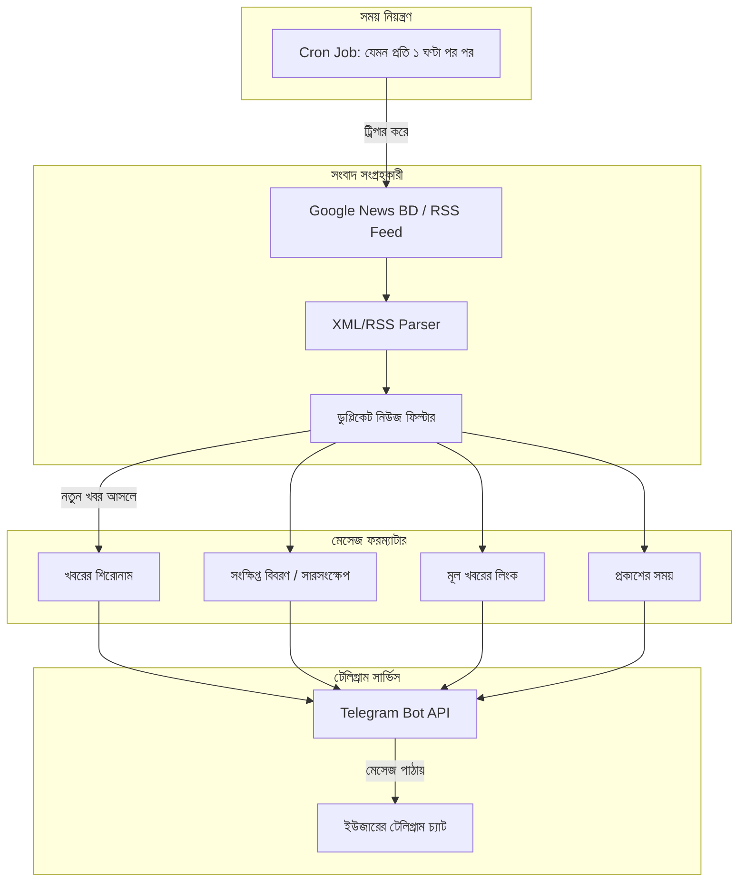

# 🏗️ System Architecture & Workflow (সিস্টেম ডিজাইন)

এই ফাইলে পুরো অটোমেশন কীভাবে কাজ করে তার কারিগরি কাঠামো ব্যাখ্যা করা হয়েছে।

---

## 📊 ডাটা ফ্লো ডায়াগ্রাম

---

## 🧩 মূল কম্পোনেন্টসমূহ
1. **Collector Module (`src/news.js`):**
   - বিভিন্ন সোর্স থেকে তাজা খবর ফেচ করে আনে।
   - ইতিমধ্যে পাঠানো খবর মনে রাখে যাতে একই খবর বারবার না পাঠায়।
2. **Bot Dispatcher (`src/bot.js`):**
   - টেলিগ্রামের অফিসিয়াল API ব্যবহার করে ইউজারকে সুন্দর মার্কডাউন বা HTML ফরম্যাটে নিউজ পাঠায়।
3. **Scheduler Module:**
   - ব্যাকগ্রাউন্ডে নিয়মিত বিরতিতে স্বয়ংক্রিয়ভাবে এক্সিকিউট করে।
